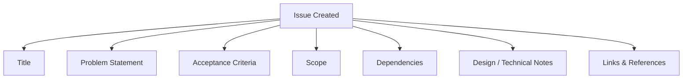
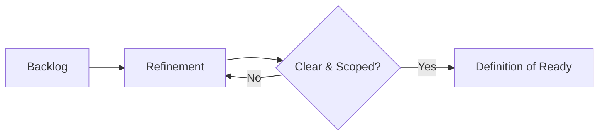
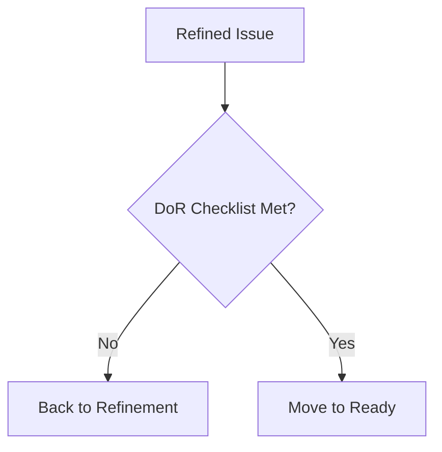
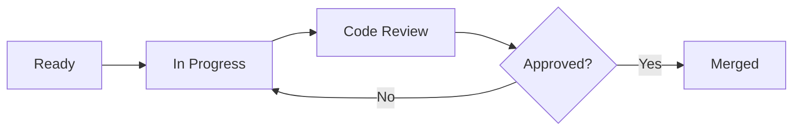
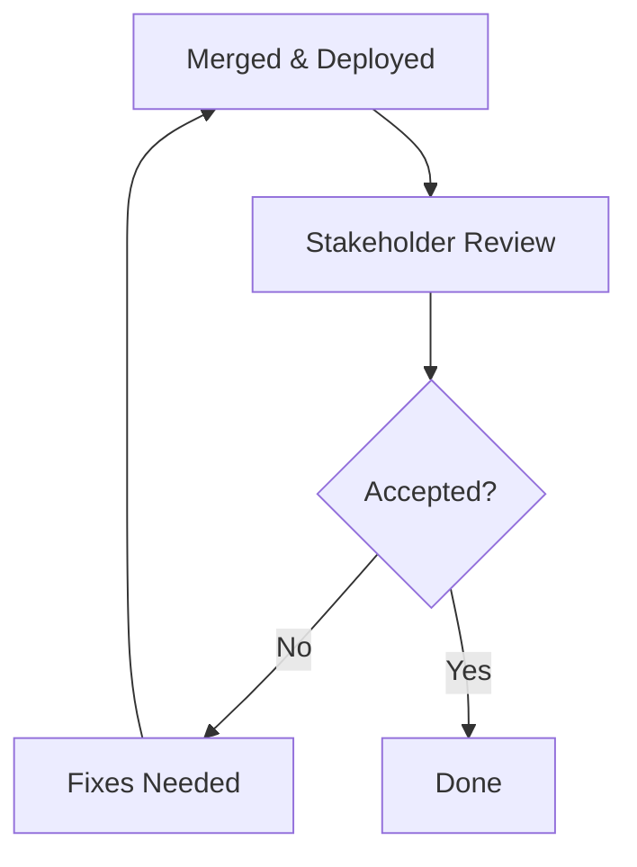
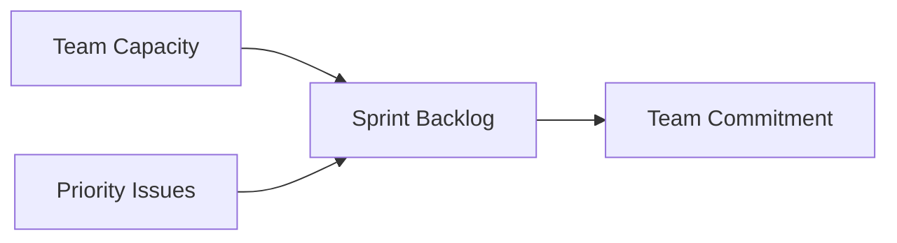
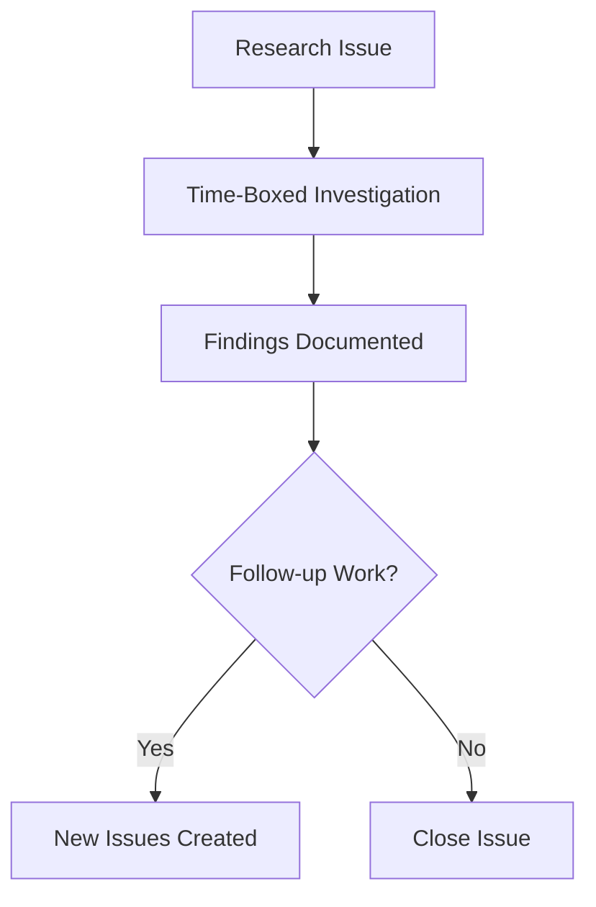
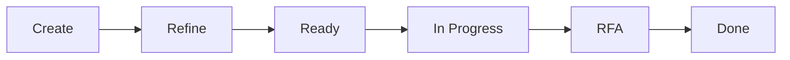
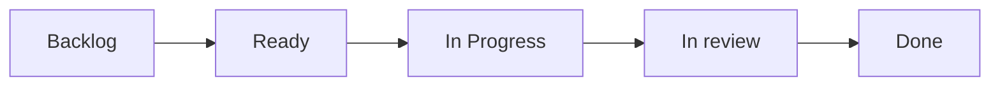

# Issue Lifecycle and Standards

This page documents how our team creates, refines, works, and completes issues. It also defines shared terminology and standards so work is predictable, visible, and consistently high-quality.

---

## 1. Creating Issues

### Purpose
Issues exist to:
- Capture a problem, opportunity, or requirement
- Provide enough context for the team to understand *why* the work matters
- Enable accurate estimation, prioritization, and delivery

### When to Create an Issue
Create an issue when:
- A user-facing bug is identified
- A feature or enhancement is requested
- Technical debt needs to be addressed
- Research or investigation is required
- Operational or infrastructure work is needed

### Ownership
- **Assignee**: Person responsible for delivery

### Sub-issues
Sub issues exist to:
- Break down parent issue into anything developer wishes to track
- Allow developer to see what is left until acceptance criteria is met
- Other develoeprs to see what's left and be able to pick up work easier if teammate is out.

### Ownership
- **Assignee**: Managed by assignee. is able to close and manage all sub issues on their own.

---

## 2. What to Include in an Issue

Every issue must include the following sections:

### Title
- Clear, concise, and action-oriented
- Example: `Add validation for email field on signup form`

### Description / Problem Statement
- Who is affected?
- What is the problem or goal?
- Why does this matter?

### Acceptance Criteria
- Specific, testable conditions that must be true for the issue to be considered complete
- Use bullet points or Given/When/Then format

### Scope
- What is included
- What is explicitly out of scope

### Dependencies
- Blockers, upstream work, or external dependencies

### Design / Technical Notes (if applicable)
- Architecture considerations
- APIs, data models, or design references

### Links & References
- Docs
- Related issues or PRs

### Mermaid – Issue Template Structure



---

## 3. Refinement

### Purpose
Refinement ensures issues are:
- Understood by the team
- Appropriately scoped and estimated
- Prioritized correctly

### Refinement Activities
- Clarify requirements
- Break large issues into smaller ones
- Identify risks and dependencies
- Add acceptance criteria
- Assign labels and tentative estimates

### Outcomes
An issue leaving refinement should:
- Have a clear goal
- Have defined acceptance criteria
- Be small enough to complete in a single sprint (or explicitly marked as an epic)

### Mermaid – Refinement Flow



---

## 4. Definition of Ready (DoR)

An issue is **Ready** when:

- [ ] Clear title and description
- [ ] Acceptance criteria defined
- [ ] Scope is understood
- [ ] Dependencies identified
- [ ] Designs/specs attached (if required)
- [ ] Size/estimate assigned
- [ ] Priority set

### Mermaid – DoR Gate



---

## 5. Working on Issues

### Assignment
- Issues should be assigned before work begins
- If ownership changes, update the assignee

### Status Updates
- Keep the issue updated with:
  - Progress notes
  - Blockers
  - Design or technical decisions

### Branching / PRs
- Reference the issue ID in branch names and pull requests
- Example: `feat/iss_123_add-email-validation`

### Communication
- Flag blockers early
- Use comments to document decisions or trade-offs
- Tag necessary teammates and stakeholders

### Mermaid – Work in Progress Flow



---

## 6. RFA (Ready for Acceptance)

An issue is **RFA** when:

- Development is complete
- All acceptance criteria are met
- Code is merged
- Feature is deployed to the appropriate environment

### RFA Checklist
- [ ] Acceptance criteria verified
- [ ] Tests written and passing
- [ ] No known critical bugs
- [ ] Documentation updated (if needed)
- [ ] Stakeholders notified for review

### Mermaid – Acceptance Flow



---

## 7. Definition of Done (DoD)

An issue is **Done** when:

- [ ] Meets all acceptance criteria
- [ ] Code reviewed and approved
- [ ] Tests passing (unit/integration/e2e as applicable)
- [ ] Deployed to production (or target environment)
- [ ] No open critical or high-priority bugs
- [ ] Documentation updated
- [ ] Monitoring/alerts updated if needed

---

## 8. Capacity & Commitment

### Capacity
Capacity is the total amount of work the team can realistically complete

Factors include:
- Team availability
- Historical velocity
- Support/maintenance load

### Commitment
Commitment is the set of issues the team agrees to deliver

Guidelines:
- Do not commit beyond known capacity
- Prioritize high-impact, high-confidence work
- Leave buffer for unplanned work

### Mermaid – Sprint Planning Model



---

## 9. Research Label

### Purpose
Research labels indicate that work is exploratory and outcomes are uncertain.

### Common Label

- `research`
  - General investigation or discovery

### Expectations for Research Issues
- Must have a clear question or goals
- Must be time-boxed
- Must produce a documented outcome:
  - Summary
  - Recommendation
  - Follow-up issues

### Mermaid – Research Workflow



---

## 10. Lifecycle Summary



This flow ensures transparency, quality, and predictable delivery across the team.

---

## 11. Continuous Improvement

This document should be reviewed regulary. Team members are encouraged to suggest improvements based on:
- Retrospective feedback
- Delivery metrics
- Team pain points

---

## 12. GitHub Project Board Setup ([XR Project](https://github.com/users/vitaovich/projects/3))



---

## 13. Branching & PR Standards

### Branch Naming

```
feat/iss_123_short-description
bug/iss_456_short-description
research/iss_789_short-description
```

### PR Title Format

```
[ISSUE-123] Add email validation to signup form
```

### PR Checklist (Recommended)

```markdown
- [ ] Acceptance criteria met
- [ ] Tests added/updated
- [ ] Documentation updated
- [ ] No breaking changes
- [ ] Ready for Acceptance
```

---
