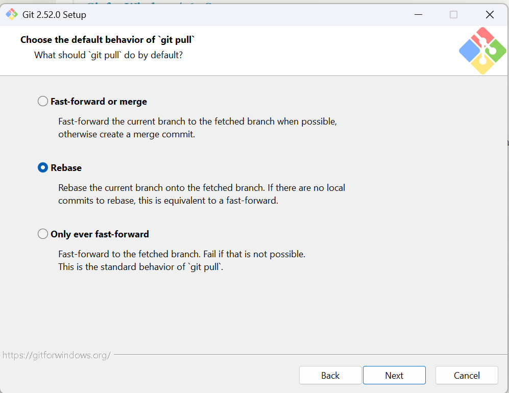
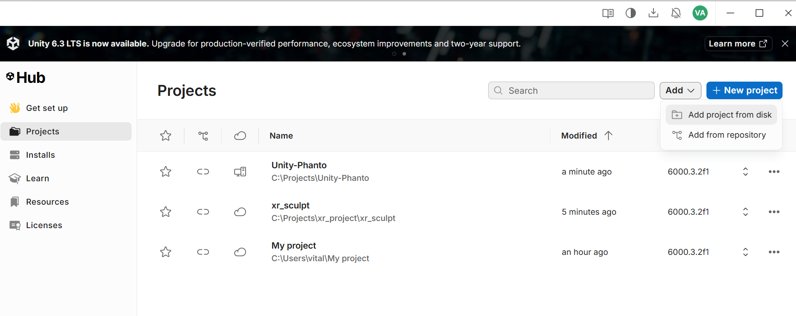
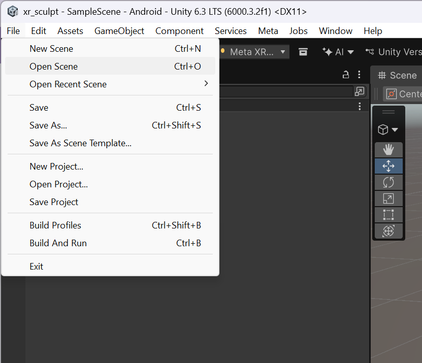
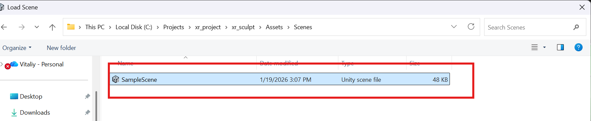

# xr_project
Manage XR project

# Getting Started
## Prerequisites
- install [git (download link)](https://git-scm.com/install/windows)  - for pulling repo down and managing version control.
    - Useful for managing your project.
    - Note: follow default installation. Only adjust Choose the default behavior of `git pull`
        - 
- Familiarized yourself with [Unity Hello World for Meta Quest VR headsets](https://developers.meta.com/horizon/documentation/unity/unity-tutorial-hello-vr/) and it's prerequisites.
- Install your favorite text editor. My favorite is [VSCode (Visual Studio Code)](https://code.visualstudio.com/)

## Step 1: Clone repo down locally.
- In a terminal run `git clone https://github.com/vitaovich/xr_project.git`

## Step 2: Open Unity Hub and Add project from disk
- Navigate to where you cloned your repo in Step 1. Then select `xr_sculpt`.
    

## Step 3: Open SampleScene
- Navigate to File -> Open Scene

- Select SampleScene under path `xr_project/xr_sculpt/Assets/Scenes`

cool